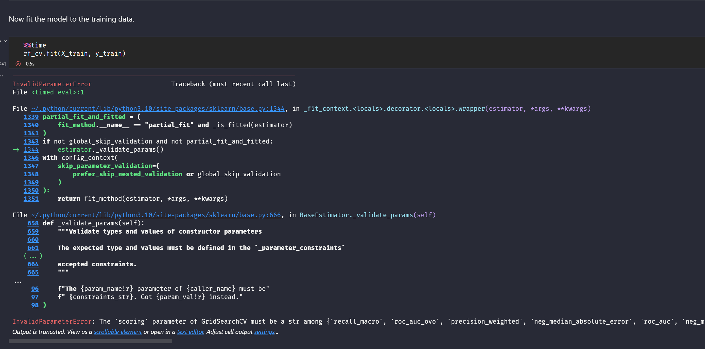

# Course 6: The Nuts and Bolts of Machine Learning

This course covers the fundamentals of supervised machine learning, and introduces learners to unsupervised learning through K-means and other clustering models. Learners will use different classification techniques such as decision trees, random forests, and gradient boosting to approach a realistic business problem. 

## Course 6 content

**Module 1: The different types of machine learning**

In this section of the course, you will learn about the high-level landscape of machine learning and explore two of its main types: supervised and unsupervised learning. You’ll also analyze different types of data, determining whether they are categorical or continuous variables. You’ll learn about a type of modeling called a recommendation system. Finally, you’ll consider the ethical issues related to machine learning and learn some best practices for building ethical models. 

**Module 2: Workflow for building complex models**

In this section of the course, you will learn about the whole process of machine learning, from starting out with a business problem and creating a model to solve it. You’ll understand more of the preparatory steps that are needed to create a successful model, create a model of your own, and analyze the performance of the model in relation to the business need.

**Module 3: Unsupervised learning techniques**

This section of the course focuses on unsupervised learning. You’ll learn how to build a K-means clustering model and explore several other clustering techniques. You’ll understand how unsupervised and supervised learning methods are different, and when and why to apply each type of model. 

**Module 4: Tree-based supervised learning**

In this section of the course, you will learn about tree-based modeling. Tree-based models are more advanced predictive techniques that fall under the umbrella of supervised learning. You will learn about decision trees and how they can be used to approach classification problems, as well as complex models, such as random forests, adaptive boosting, and gradient boosting. Finally, you’ll learn how tuning hyperparameters can help you get the best performance out of your model. 

**Module 5: Course 6 end-of-course project**

As you conclude this part of the Advanced Data Analytics Certificate, you will put everything you’ve learned into one end-of-course project. You’ll be tasked with solving a business problem using the provided data. The concepts and skills you will learn in this part of the course will be critical to your success as a data professional. 

## Answer Key Correction

If you check the original answer key provided by Google, unfortunately, some code doesn't run; it consumed Google, too. 

At the beginning of the contract model random forest and XGBoost stage, google made a mistake, so it couldn't run. Both mistakes happen when starting to build both models. 

Here is the error shows up:

The reason for this error is that the machine can't read string. So I replace string with a number, and the notebook will run expert. 

Here is what I do:
When building the model, I replaced from 
`scoring = {'accuracy', 'precision', 'recall', 'f1}` to `scoring = {'accuracy': 'accuracy,' 'precision': 'precision', 'recall': 'recall', 'f1': 'f1'}`

The updated notebook should run, except for reference; I will keep both files here. 

**Dataset columns explanation**

| Column name            | Type  | Description                                            |
|------------------------|-------|--------------------------------------------------------|
| ID                     | int   | A sequential numbered index                            |
| label                  | obj   | Binary target variable (“retained” vs “churned”) for if a user has churned anytime during the course of the month |
| sessions               | int   | The number of occurrence of a user opening the app during the month |
| drives                 | int   | An occurrence of driving at least 1 km during the month |
| device                 | obj   | The type of device a user starts a session with        |
| total_sessions         | float | A model estimate of the total number of sessions since a user has onboarded |
| n_days_after_onboarding| int   | The number of days since a user signed up for the app  |
| total_navigations_fav1 | int   | Total navigations since onboarding to the user’s favorite place 1 |
| total_navigations_fav2 | int   | Total navigations since onboarding to the user’s favorite place 2 |
| driven_km_drives       | float | Total kilometers driven during the month                |
| duration_minutes_drives| float | Total duration driven in minutes during the month       |
| activity_days          | int   | Number of days the user opens the app during the month |
| driving_days           | int   | Number of days the user drives (at least 1 km) during the month |
