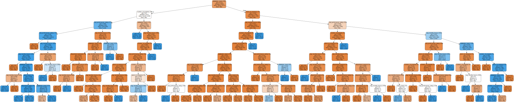

# Course 7: Google Advanced Data Analytics Capstone

**Salifort Motors Workforce Analysis: Employee Turnover Forecast**

## Background Infomation

Salifort Motors is a fictional French-based alternative energy vehicle manufacturer. Its global workforce of over 100,000 employees research, design, construct, validate, and distribute electric, solar, algae, and hydrogen-based vehicles. Salifort’s end-to-end vertical integration model has made it a global leader at the intersection of alternative energy and automobiles.

As a data specialist working for Salifort Motors, you have received the results of a recent employee survey. The senior leadership team has tasked you with analyzing the data to come up with ideas for how to increase employee retention. To help with this, they would like you to design a model that predicts whether an employee will leave the company based on their department, number of projects, average monthly hours, and any other data points you deem helpful.

## Step Approach

We will use follow PACE framework for this projects:

### Plan

- **Objective:** To develop a predictive model that forecasts employee turnover at Salifort Motors based on key factors such as department, number of projects, average monthly hours, and other relevant data points.
- **Scope:** The model will focus on classifying employees into categories of 'likely to leave' or 'likely to stay'. Additional parameters like employee satisfaction, experience, and performance ratings may be considered.
- **Data Requirements:** For the data set provided by Google, for the column explanation, see Course7 -> README.
- **Stakeholders:** Senior leadership team, HR department, departmental managers, etc.

### Analyze

- **Data Cleaning:** Address missing values, outliers, and duplicates in the given data, ensure data types are appropriate for analysis.
- **Data Processing:** Transform categorical data into a format suitable for modeling.
- **Exploratory Data Analysis (EDA):** Conduct an initial analysis to understand the distribution of key variables, identify patterns, and detect any anomalies or interesting correlations.
- **Feature Selection:** Determine which variables are most relevant for predicting employee turnover. This involve statistical tests and correlation analysis.

### Construct

- **Model Selection:** Decision Tree model: Justify the choice based on the model's simplicity, interpretability, and suitability for the data.
- **Validation:** Split the data into training and testing sets to validate the model's performance. Use K-Fold Cross-Validation and GridSearch for optimization.

*Note: Among regression analysis, unsupervised/supervised Learning, supervised learningis the best fit for this scenario.*

### Execute

- **Results Interpretation:** Analyze the results to identify the most significant predictors of employee turnover. Understand how different variables interact and influence the outcome.
- **Conclusion and Recommendations:** Draw conclusions based on the model's findings. Propose actionable recommendations for reducing employee turnover.
- **Feedback and Iteration:** Provide feedback to stakeholders to make the company better - reduce the employee churn rate. 

### What's next...
- **Model Refinement:** After the initial implementation of the Decision Tree model, assess its performance and identify areas for improvement.
- **Alternative Models:** Explore other modeling techniques like Random Forest and XGBoost. These models can better handle more extensive features and complex interactions, improving predictive accuracy.

---

## Decision tree

Although I had used the `plot_tree()` function to draw the tree inside the notebook, but the graphviz version is also available. The document is uploaded [here](./decision_tree). If you are interested, go to [Graphviz Online](https://dreampuf.github.io/GraphvizOnline/), paster all the text, and you should see a well-constructed decision tree. 

### Example output: 

Download image [here](./graphviz.svg).

---

## Insights

### Suggestions/Recommendations

- **Address Overwork:** Implement policies to ensure employees are not consistently working excessive hours, as high average monthly hours were linked to turnover. Encouraging a better work-life balance can improve job satisfaction and reduce burnout.

- **Improve Career Development Opportunities:** Offer clear pathways for advancement and professional growth. Employees who have not been promoted in the last five years are more likely to leave, indicating the importance of recognizing and rewarding employee contributions.

- **Enhance Job Satisfaction:** Focus on improving the factors that contribute to job satisfaction. Given that both low satisfaction levels and poor performance ratings are linked to higher turnover, initiatives to enhance employee engagement and satisfaction could be beneficial.

- **Project Distribution:** Employees handling a higher number of projects, particularly more than the average range of 3-4, are more likely to leave. Workload distribution should be monitored to ensure that it is equitable and manageable.

### Conclusion

The decision tree model revealed that factors such as overwork, lack of promotions, lower salary levels and high number of projects were affecting employee turnover. By addressing these areas, companies can take proactive steps to improve retention. It is important for companies to continue collecting data and refining their understanding of employee turnover to ensure interventions are effective.

### Feedback

The model provides valuable insights, however, data-driven models are simplifications of complex human behavior. Therefore, companies should treat these findings as guidance rather than absolute facts. It is recommended to combine these insights with qualitative data, such as employee feedback and satisfaction surveys, to gain a more complete understanding of employee turnover. As your company grows and your workforce evolves, it's critical to continually monitor and adjust your strategy.

### What's Next...

- **Model Deployment:** Once a model is built and validated, deploying it into a production environment is the next stage. 
- **Continuous Monitoring and Maintenance:** After deployment, continuous monitoring is crucial to ensure the model performs well with new data over time. 
- **Exploring Other Models:** While the decision tree model provides a good starting point, there's always room for improvement such as Random forests and XGBoost

---

## Dataset columns explanation

*Note: Some column names could be better; I replaced some columns with better ones. Typically, 0 means False/No, and 1 means True/Yes.*

| Column name               | Type  | Description                                                  |
|---------------------------|-------|--------------------------------------------------------------|
| satisfaction_level        | int64 | The employee’s self-reported satisfaction level [0-1]        |
| last_performance_rating   | int64 | Score of employee's last performance review [0-1]            |
| number_of_projects        | int64 | Number of projects the employee contributes to               |
| avg_monthly_hours         | int64 | Average number of hours the employee works per month         |
| years_at_company          | int64 | How long the employee has been with the company (years)      |
| had_work_accident         | int64 | Whether the employee had an accident at work (yes or no)     |
| has_left_company          | int64 | Whether the employee has left the company (yes or no)        |
| promoted_in_last_5_years  | int64 | Whether the employee was promoted in the last 5 years        |
| department                | str   | The department where the employee works                      |
| salary_level              | str   | The salary category of the employee (low, medium, or high)   |

## Answer Key

[Exemplar](./Exemplar_%20Course%207%20Salifort%20Motors%20project%20lab.ipynb) provided by Google also uploads. 

